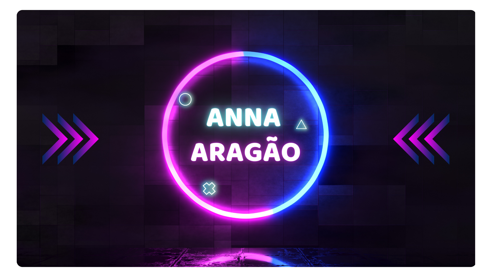

###  <h2 align="center">👋 Heyyy, I'm </h2>

<source
          media="(prefers-color-scheme: dark)"
          srcset="assets/apresentacao.png"
        />
        

	<a href="https://github.com/Lolinnha">
	

<h4 align="center"> 💡 Project & Product Management • 🎮 Game Dev • 💻 Front-End</h4>
 
<table border="0">
  <tr>
    <td width="50%" rowspan="2">
      <picture>
         <source
          media="(prefers-color-scheme: dark)"
          srcset="assets/controle.png"
        />
        
      </picture>
    </td>
    <td align="center">
      <picture width="100%">
        
      </picture>
    </td>
  </tr>
  <tr>
    <td align="center">
      <picture width="100%">
      
      </picture>
    </td>
  </tr>
</table>

### Languages and Tools 

  <!-- For more icons please follow  https://github.com/MikeCodesDotNET/ColoredBadges -->
      
  
  
  
  

 
